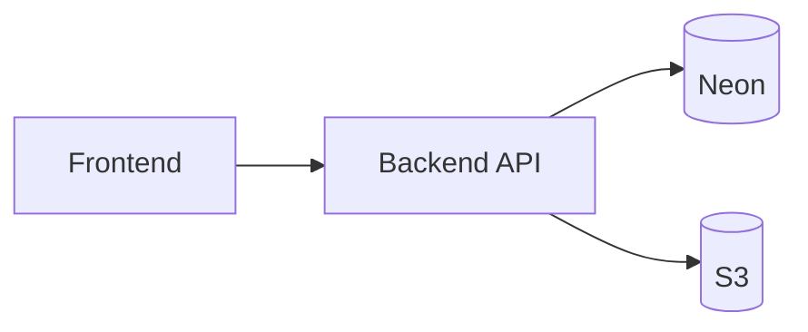

# Metropolis Nexus (DriveBnb)

P2P car-share: React frontend, Flask backend, Neon PostgreSQL, AWS S3 for uploads.



## Start (Docker)

```bash
docker compose up --build
```

- Frontend: http://localhost:3000  
- Backend: http://localhost:5000 · API docs: http://localhost:5000/docs  

Uses `.env` in project root (Neon `DATABASE_URL`, AWS S3 vars). Backend runs migrations on start.

Rebuild after dependency or Dockerfile changes:

```bash
docker compose up --build
```

## Start (local)

**Backend** (terminal 1):

```bash
cd backend
uv sync
export $(grep -v '^#' ../.env | xargs)
alembic upgrade head
PORT=5000 FLASK_DEBUG=1 python run.py
```

**Frontend** (terminal 2):

```bash
cd frontend
npm install
VITE_API_URL=http://localhost:5000 npm run dev
```

- Frontend: http://localhost:5173  
- Backend: http://localhost:5000  

## Database migrations

New revision:

```bash
cd backend
alembic revision -m "describe change"
# edit alembic/versions/<file>.py
```

Apply:

```bash
# local
cd backend && alembic upgrade head

# docker
docker compose exec backend alembic upgrade head
```

Update `db/schema.sql` when schema changes.

## Dependencies

**Backend** — `backend/pyproject.toml` (uv). Docker uses `backend/requirements.txt`:

```bash
cd backend && uv pip compile pyproject.toml -o requirements.txt
docker compose build backend
```

**Frontend** — `frontend/package.json`:

```bash
cd frontend && npm install
```
