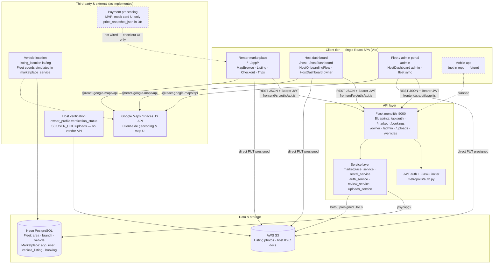
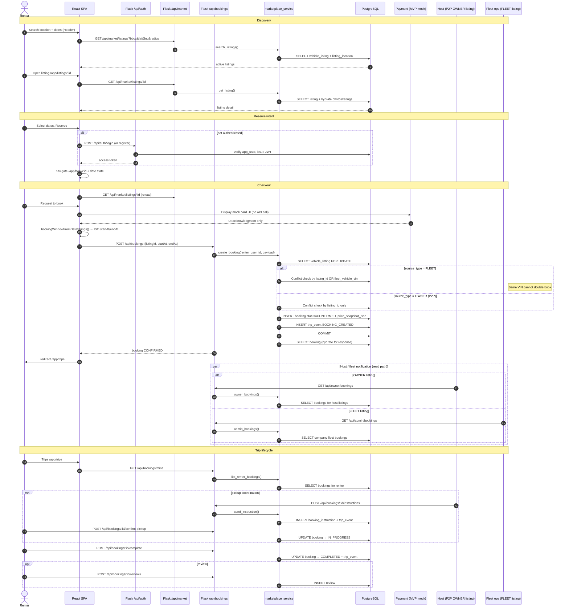

# Metropolis Nexus — Architecture Diagrams

Mermaid diagrams reflecting the current codebase. Render in GitHub, GitLab, VS Code (Mermaid preview), or [mermaid.live](https://mermaid.live).

| Diagram | Section |
|---------|---------|
| System architecture | [§1](#1-high-level-system-architecture) |
| Booking flow (sequence) | [§2](#2-booking-flow-sequence) |
| Database ER | [§3](#3-database-entity-relationship) |

**Notes:** Single React SPA (no mobile app). Flask monolith (no API gateway). Payment is mock UI only; no Stripe. KYC is `owner_profile` + S3 docs. No `maintenance_log` table — fleet health uses `vehicle.status`.

---

## 1. High-Level System Architecture



---

## 2. Booking Flow (Sequence)

End-to-end path: search → listing → checkout → `POST /api/bookings` → `marketplace_service.create_booking()` (status `CONFIRMED` on create).



**Legacy path (not used by checkout UI):** `GET /api/vehicles/available` and `GET /api/reservations?email=` via `rental_service`.

---

## 3. Database Entity-Relationship

Schema from `db/schema.sql` plus migrations `004`–`012`. PostgreSQL lowercases unquoted identifiers.

```mermaid
erDiagram
    app_user ||--o| owner_profile : "user_id PK/FK 1:1"
    app_user }o--o{ roles : "user_roles M:N"
    app_user ||--o{ vehicle_listing : "owner_user_id 1:N"
    app_user ||--o{ booking : "renter_user_id 1:N"
    app_user ||--o{ booking_instruction : "owner_user_id 1:N"
    app_user ||--o{ trip_event : "actor_user_id 0..N"
    app_user ||--o{ review : "author_user_id 1:N"
    app_user ||--o{ organization_members : "user_id M:N"
    app_user ||--o{ file_asset : "owner_user_id 0..N"

    roles {
        int id PK
        string name UK
    }

    user_roles {
        bigint user_id PK_FK
        int role_id PK_FK
    }

    owner_profile {
        bigint user_id PK_FK
        string verification_status
        text payout_ref
    }

    organizations ||--o{ organization_members : "organization_id 1:N"
    organizations ||--o{ vehicle_listing : "owner_organization_id 0..N"

    organizations {
        bigint id PK
        string name
    }

    organization_members {
        bigint user_id PK_FK
        bigint organization_id PK_FK
    }

    area ||--o{ branch : "areaid 1:N"
    branch ||--o{ employee : "branchid 1:N"
    branch ||--o| branchmanager : "branchid 1:1"
    vehicleclass ||--o{ vehicle : "classid 1:N"
    branch ||--o{ vehicle : "branchid 1:N"
    area ||--o{ relocation : "source_target M:N pair"
    branch ||--o{ company_parking_spot : "branch_id 0..N"
    area ||--o{ company_parking_spot : "area_id 1:N"

    area {
        int areaid PK
        string areaname
    }

    branch {
        int branchid PK
        int areaid FK
        int managerid FK
        decimal lat
        decimal lng
    }

    vehicle {
        char17 vin PK
        int classid FK
        int branchid FK
        string status
        string make
        string model
        int mileage
    }

    vehicleclass {
        int classid PK
        string classname
        decimal securitydeposit
    }

    company_parking_spot {
        bigint id PK
        int area_id FK
        int branch_id FK
        decimal lat
        decimal lng
    }

    vehicle ||--o| vehicle_listing : "fleet_vehicle_vin"
    vehicleclass ||--o{ vehicle_listing : "vehicle_class_id"
    branch ||--o{ vehicle_listing : "branch_id"
    company_parking_spot ||--o{ vehicle_listing : "parking_spot_id"

    vehicle_listing ||--|| listing_location : "listing_id PK/FK 1:1"
    vehicle_listing ||--o{ listing_availability : "listing_id 1:N"
    vehicle_listing ||--o{ booking : "listing_id 1:N"
    vehicle_listing }o--o{ file_asset : "listing_image M:N"
    vehicle_listing ||--o{ review : "target_listing_id"

    vehicle_listing {
        bigint listing_id PK
        bigint owner_user_id FK
        char17 fleet_vehicle_vin FK
        bigint owner_organization_id FK
        enum source_type "OWNER or FLEET"
        decimal price_per_day
        boolean is_company_owned
        boolean active
    }

    listing_location {
        bigint listing_id PK_FK
        decimal lat
        decimal lng
        string city_zone
    }

    listing_availability {
        bigint availability_id PK
        bigint listing_id FK
        timestamptz start_at
        timestamptz end_at
        enum status "AVAILABLE or BLOCKED"
    }

    booking ||--o{ booking_instruction : "booking_id 1:N"
    booking ||--o{ trip_event : "booking_id 1:N"
    booking ||--o{ review : "booking_id 1:N"

    booking {
        bigint booking_id PK
        bigint listing_id FK
        bigint renter_user_id FK
        timestamptz start_at
        timestamptz end_at
        enum status "PENDING CONFIRMED IN_PROGRESS COMPLETED CANCELLED"
        jsonb price_snapshot_json
    }

    booking_instruction {
        bigint instruction_id PK
        bigint booking_id FK
        bigint owner_user_id FK
        text message
    }

    trip_event {
        bigint event_id PK
        bigint booking_id FK
        bigint actor_user_id FK
        string event_type
        jsonb metadata_json
    }

    file_asset {
        bigint file_id PK
        bigint owner_user_id FK
        bigint listing_id FK
        string object_key UK
        enum scope "FLEET OWNER_LISTING USER_DOC"
    }

    listing_image {
        bigint listing_id PK_FK
        bigint file_id PK_FK
        int display_order
    }

    review {
        bigint review_id PK
        bigint booking_id FK
        bigint author_user_id FK
        bigint target_user_id FK
        bigint target_listing_id FK
        enum target_type "LISTING or RENTER"
        int rating
        int cleanliness
        int accuracy
        int communication
    }
```

---

## Source references

| Topic | Location |
|-------|----------|
| Frontend routes | `frontend/src/App.jsx` |
| API blueprints | `backend/metropolis/api/` |
| Booking logic | `backend/metropolis/services/marketplace_service.py` |
| Base schema | `db/schema.sql` |
| Migrations | `db/migrations/` |
