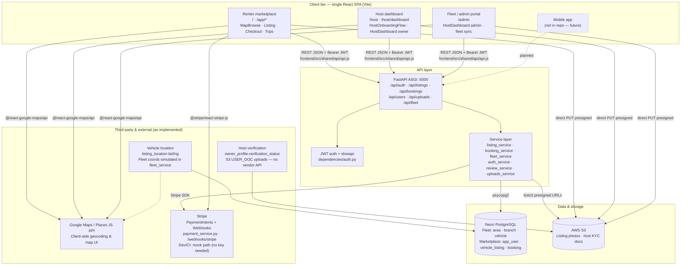
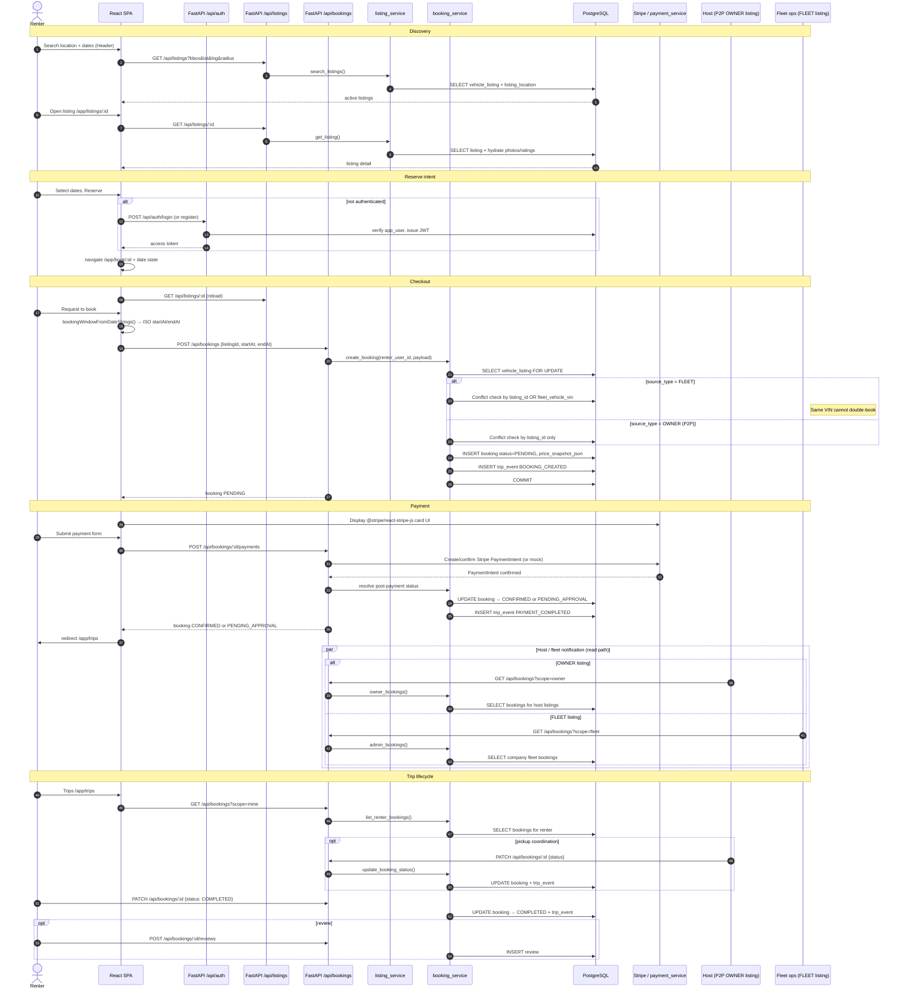

# Metropolis Nexus — Architecture Diagrams

Mermaid diagrams reflecting the current codebase. Render in GitHub, GitLab, VS Code (Mermaid preview), or [mermaid.live](https://mermaid.live).

| Diagram | Section |
|---------|---------|
| System architecture | [§1](#1-high-level-system-architecture) |
| Booking flow (sequence) | [§2](#2-booking-flow-sequence) |
| Database ER | [§3](#3-database-entity-relationship) |

**Notes:** Single React SPA (no mobile app). FastAPI monolith (no API gateway). Payments via Stripe PaymentIntents (`payment_service.py`, `/webhooks/stripe`); dev/CI uses mock path when `STRIPE_SECRET_KEY` is absent. KYC is `owner_profile` + S3 docs. No `maintenance_log` table — fleet health uses `vehicle.status`. API docs at `/docs` (FastAPI Swagger).

---

## 1. High-Level System Architecture

---

## 2. Booking Flow (Sequence)

End-to-end path: search → listing → checkout → `POST /api/bookings` (status `PENDING`) → `POST /api/bookings/:id/payments` (Stripe PaymentIntent or dev mock) → status transitions to `CONFIRMED` or `PENDING_APPROVAL`.

---

## 3. Database Entity-Relationship

Canonical schema: `db/schema.sql`, applied on empty databases via Alembic baseline `000001_new_base`. For current ER diagrams split by domain, see [database-schema.md](database-schema.md).

---

## Source references

| Topic | Location |
|-------|----------|
| Frontend routes | `frontend/src/app/App.jsx` |
| API routers | `backend/metropolis/routers/` |
| ASGI entry (HTTP + Socket.IO) | `backend/metropolis/asgi.py` |
| Auth dependencies | `backend/metropolis/dependencies/auth.py` |
| Pydantic schemas | `backend/metropolis/schemas/*_models.py` |
| Booking logic | `backend/metropolis/services/booking_service.py` |
| Listing logic | `backend/metropolis/services/listing_service.py` |
| Fleet logic | `backend/metropolis/services/fleet_service.py` |
| Payment logic | `backend/metropolis/services/payment_service.py` |
| Stripe webhook | `backend/metropolis/routers/webhooks.py` |
| Socket.IO | `backend/metropolis/sockets/booking_chat.py` |
| ARQ booking sweep | `backend/metropolis/jobs/booking_sweep.py` |
| Base schema | `db/schema.sql` |
| Active migrations | `backend/alembic/versions/` |
| ER diagrams (current) | `docs/database-schema.md` |
