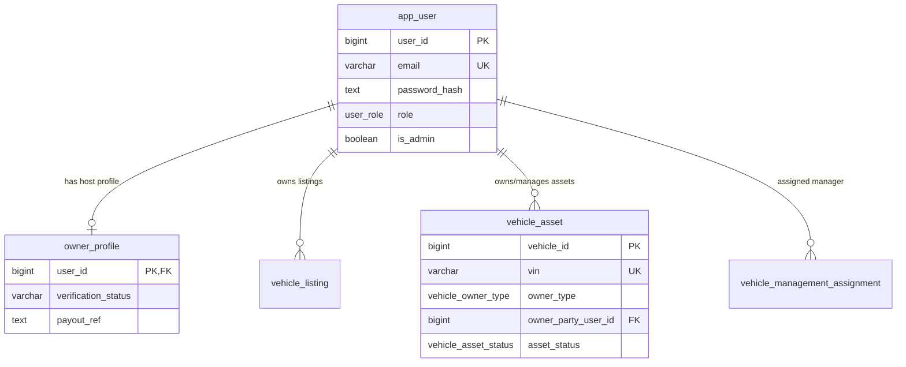
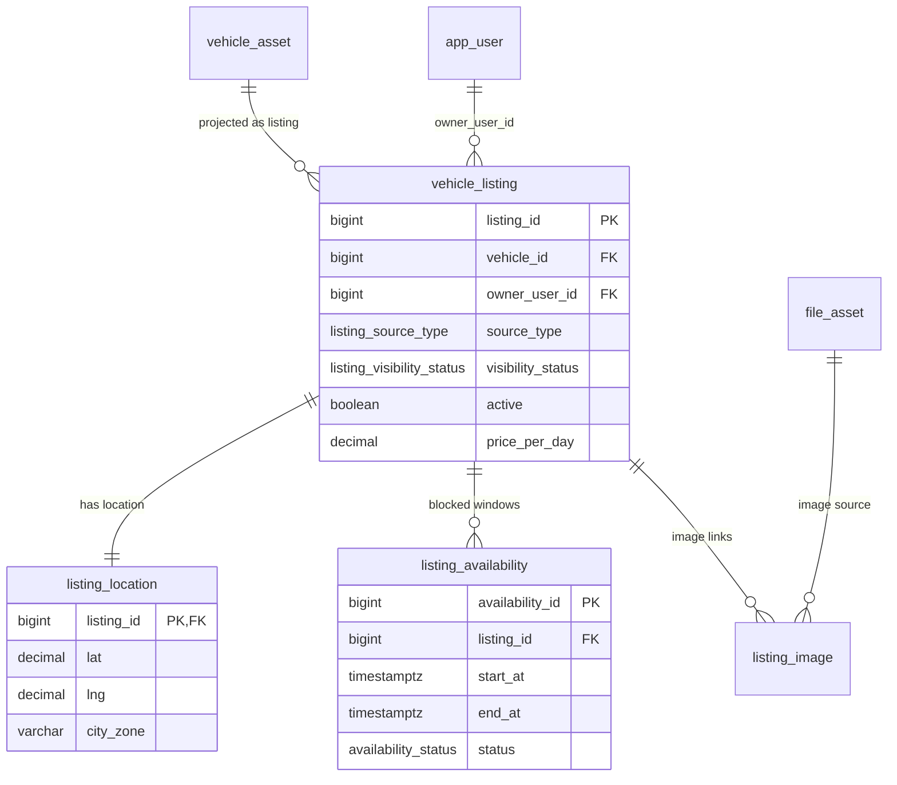
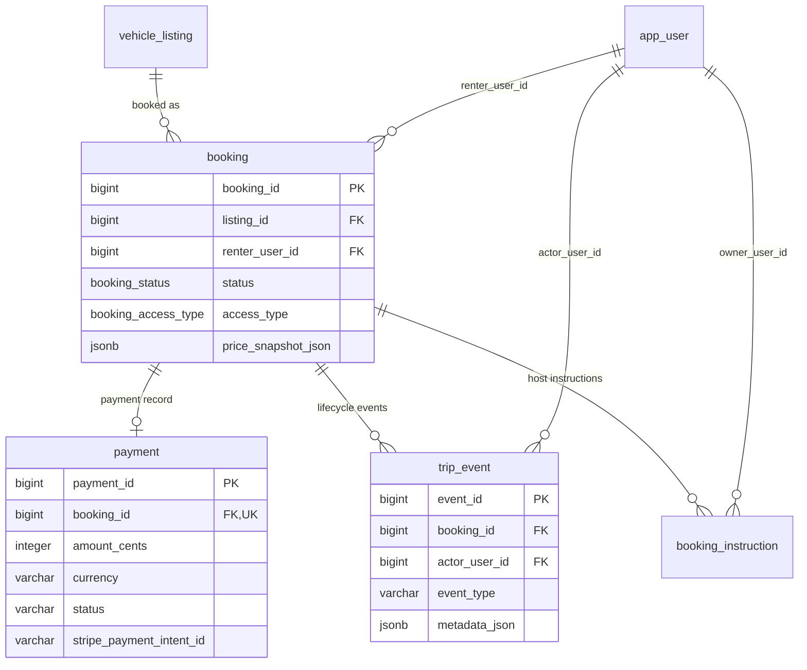
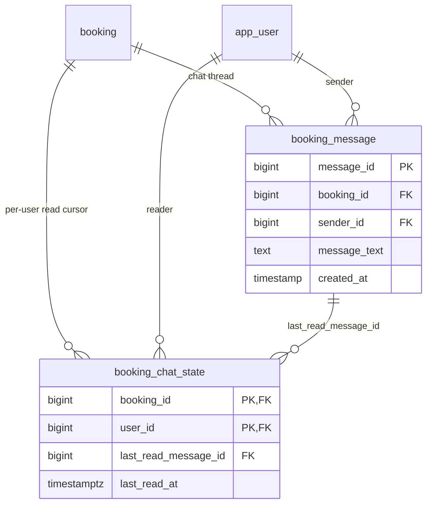
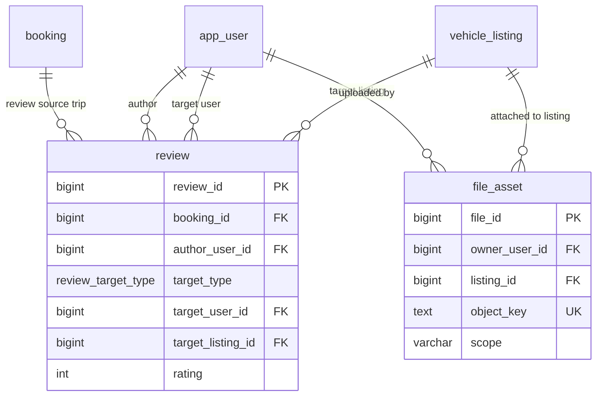
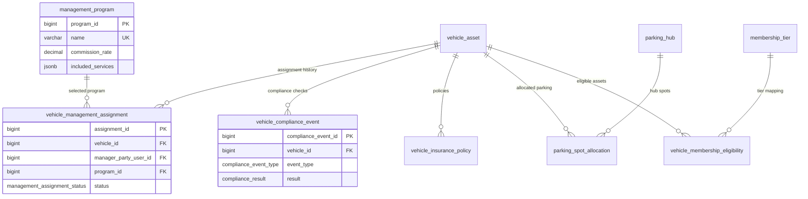

# Database Schema (ER Diagrams)

Mermaid ER diagrams for current schema, split by domain flow/API surface so each diagram stays readable.

---

## 1) Identity + Ownership Flow (`/api/auth`, host onboarding, admin host verification)

---

## 2) Asset + Listing Catalog Flow (`/api/listings`, `/api/listings?scope=*`, browse/search)

---

## 3) Booking + Payment + Trip Lifecycle (`/api/bookings*`, `/webhooks/stripe`)

---

## 4) Chat / Inbox Flow (`/api/bookings/:id/messages`, inbox page)

---

## 5) Reviews + Media Flow (`/api/listings/:id/reviews`, uploads)

---

## 6) Managed Hosting + Fleet Operations Flow (`/api/fleet/*`, company operations)

